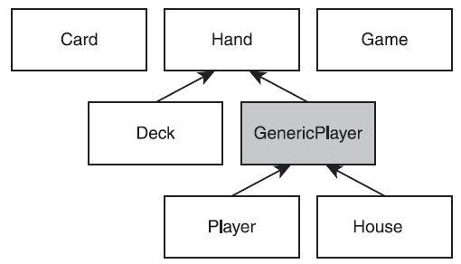

# Blackjack console game

The game works like this: Players are dealt cards with point values. Each player tries to reach a total of 21 without
exceeding that amount. Numbered cards count as their face value. An ace counts as either 1 or 11 (whichever is best for the player), and any jack, queen, or king counts as 10.

### Inheritance hierarchy class diagram

